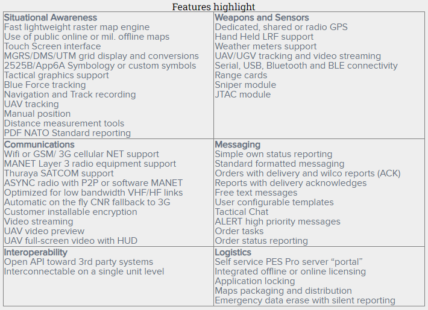
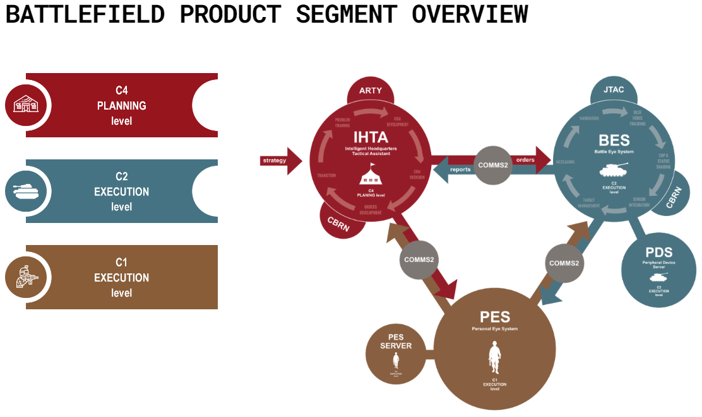

# Personal Eye System
Personal Eye System (PES) je osobní mobilní aplikace pro sledování, navigace a komunikaci pro vojenské a bezpečnostní složky ale také pro vojenské/polovojenšké zájmové skupiny. Je vyvíjena společností MIL SISTEMIKA pro operační systém Android. Je to součástí Milsistemika C4I Suite pro plánování a vykonávání vojenských (ale i jiných) operací jak na štábní tak na osobní úrovni.

## Prvky
Hlavní prostředí aplikace je rastrová mapa. Aplikace podporuje jak veřejné online mapy (např. google) tak i import offline map. V aplikaci je přednastavena řada veřejných map a také několik offline map. Na mapě může být navíc zobrazen kompas.

Pro sdílení dat s ostatními uživately je nutné aby všichni tito uživatelé byly připojeni k PES serveru. K serveru se připojuje nastavením unikátního PIN v nastavení aplikace. Toto PIN funguje jako heslo do místnosti (channelu).

Na mapě je možné vyznačovat body. Tyto body mají jméno, polohu, značku a popis. K značkám je možné přikládat fotky. Aplikace má zabudované _2525_ a _App6_ značení a umožňuje také vlastní symboly. Na mapě jsou také vyznačeni uživatelé aplikace. Pro zobrazení pozice je nutné mít přístup k GPS (ale aplikace obsahuje i další senzory pro určování pozice). Dále je možné na mapě vyznačovat trasy - grafické značení vlastního pohybu s možným popiskem.

V aplikaci je zabudovaný chat. Chat je globální a mají do něj přístup všichni na daném PES serveru. V chatu je možné označit zprávu jako důležitou, která je pak zvýrazněná. V chatu jsou také přednastavené šablony zpráv, hlášení a příkazů. Tyto šablony jsou v aplikaci zabudované. Šablony jsou pouze v prostém textu a je nutné ji manuálně opravit. Pro chat je nutné mít přístup k WiFI nebo 2G/3G/LTE.

Aplikace obsahuje převodník mezi formáty geografických souřadnic MGRS/DMS/UTM.

Aplikace umožňuje propojení s laserovým dálkoměrem LRF.

Aplikace má řadu nastavení:
- __Identifikace__ - Osobní jméno, hodnost, číslo. Identifikace a symbol jednotky.
- __Jednotky__ - Různé formáty geografických souřadnic, časové formáty, jednotky rychlosti/směru/vzdálenost...
- __Sdilení dat__ - Synchronizace dat s PES serverem, synchronizace chatu a notifikací. Čas synchronizace

## Vlastnosti
PES je ideální pro osobní nasazení jednotlivým týmům (C1 segment). Slouží jako komplement pro aplikace C2 (Command & Controll) segmentu jako je BES (Battle Eye System) a IHTA (Intelligent HQ Tactical Assistant) pro rychlé sdílení informací mezi štáběm a týmy v poli.

PES může být také použit samostatně pro navigaci nebo zaměřování a kontrolu palby (hlavně s LRF pro zaměřování cílů).

## Zhodnocení
Systém byl navržen jako náhrada GPS, papírových map a mobilních telefonů. Jako plnohodnotná náhrada nestačí ale slouží jako dobrá pomůcka.

### Klady
- Funguje i bez datového připojení (zobrazují se poslední známé informace + osobní informace)
- Velký výběr map
- Integrace s ostatními produkty (BES, JTAC tool, Kestrel weather station, IHTA...)

### Zápory
- Placená aplikace
- Příprava offline map je poměrně náročné
- Sdílení obrázků u značek na mapě asi nefunguje
- Pouze jeden globální chat
- Šablony zpráv jsou pouze textové

## Zdroje
- https://milsistemika.com/products-services/command-control/
- https://milsistemika.com/products-services/command-control/pes-personal-eye-system/
- https://www.armyweb.cz/clanek/personal-eye-system-pes-zas-o-krok-blize-realite
- https://at-communication.com/en/battle-management-system/na/pes.html
- https://www.defencesystems.info/wp-content/uploads/2012/10/Users_guide-PES.pdf
