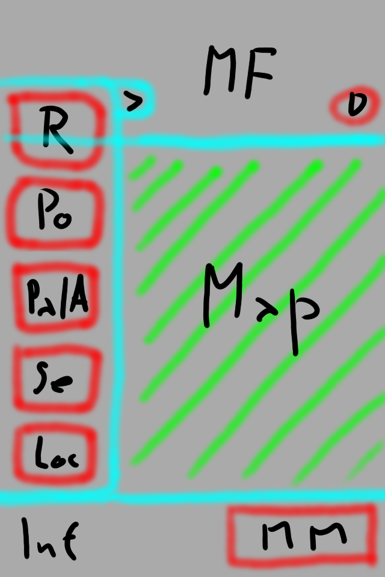

# Návrh obrazovek
Tento soubor obsahuje první návrh obrazovek, které se budou v aplikaci vyskytovat. Pro každou obrazovku je zde umístěn obrázek návrhu a popis. V popisu je vysvětlen význam a funkce jednotlivých prvků na obrazovce.

## Mapa (hlavní obrazovka)

Hlavní obrazovka obsahující mapu. Tato obrazovka bude sloužit jako úvodní obrazovka. Uživatel se po zapnutí aplikace ocitne na této obrazovce. Obrazovka je rozdělena na dvě části: __mapa__ a __spodní lišta__.

V části __mapa__ bde zobrazena načtená mapa. Na mapě se mohou vyskytovat následující prvky:
- __Aktuální pozice zařízení__ [1] - Vlastní pozice bude vizuálně odlišena od všech ostatních značek na mapě.
- __Pozice jiného zařízení__ [2] - Pozice zařízení dalších členů týmu/splubojovníků.
- __Bod na mapě__ [3] - Zadaný bod na mapě (od libovolného autora). Mohou mít různé grafické značení.
- __Cesta na mapě__ [4] - Zadaná cesta na mapě (od libovolného autora).
- __Plocha na mapě__ [5] - Zadaná plocha na mapě (od libovolného autora).

V části __mapa__ budou navíc následující ovládací prvky:
- __Zaměřovač__ [CH] - Označuje střed obrazovky.
- __Ikona rychlého menu__ [>] - V levé horní části. Po kliknutí (posunutí zleva doprava) se zobrazí _rychlé menu_. 
- __Tlačítka pro přiblížení a oddálení__ [+], [-] - V levé dolní části. Přiblíží nebo oddálí mapu o daný interval.
- __Informace o měřítku__ [Scale] - Textová informace o aktuálním měřítku (případně další informace).

Na __spodní liště__ budou dva prvky:
- __Informace__ [Inf] o aktuální pozici zaměřovače a případně další informace.
- Tlačítko __Hlavní Menu__ [MM], které přesune aplikaci na __hlavní menu__.

## Menu na hlavní obrazovce

Hlavní obrazovka obsahuje prvky, které nejsou hned viditelné: __rychlé menu__ a __panel upozornění__:

V __rychlém menu__ jsou následující tlačítka:
- __Podat hlášení__ [R] - Přesměruje na chatroom štábu pro podání hlášení.
- __Zadat bod__ [Po] - Otevře pohled zadávání bodu a následně formulář vytvoření bodu.
- __Zadat cestu nebo blochu__ [Pa/A] - Otevře submenu pro výběr _cesty_ nebo _plochy_. Následně otevře pohlde pro zadání vybraného objektu.
- __Vyhledávání__ [Se] - Zobrazí textové pole pro vyhledávání lokace na mapě.
- __Moje poloha__ [Loc] - Vycentruje mapu na moji aktuální polohu.

__Panel upozornění__ slouží pro zobrazení zpráv od štábu nebo na upozornění příchozí zprávy. Obsahuje _značku_ upozornění, _jméno odesílatele_ a _text/část textu_ zprávy. V pravém dolním rohu upozornění je tlačítko pro potvrzení/odstranění upozornění [D], které panel schová.

## Hlavní menu

Hlavní menu obsahuje tlačítka odkazující na další obrazovky/pohledy aplikace - slouží jako rozcestí. Bude obsahovat následující tlačítka:
- __Kontakty__/__Chat__ [Ch] - Zobrazí seznam kontaktů, se kterými je možné komunikovat.
- __Skupiny__ [G] - Zobrazí nastavení ohledně skupin. Štábní zařízení zde budou moct spravovat ostatní zařízení.
- __Nastavení hlášení__ [RS] - Zobrazí seznam šablon hlášení a možnost přidávat nebo editovat hlášení.
- __Nastavení bodů__ [PS] - Zobrazí seznam šablon bodů/cest/ploch a možnost přidávat nebo editovat šablonu.
- __Další nastavení__ [OS] - Další nastavení, které nespadají do ostatních kategorií.
- __Nastavení spojení__ [CS] - Systémová nastavení, nastavení spojení, nastavení akce atd..

## Seznam kontaktů

Seznam kontaktů obsahuje seznam všech kontaktů, se kterými je možné ze zařízení komunikovat. Kontakty budou rozděleny do tří skupin:
1. skupina bude obsahovat kontakty se štábem. Budou zde tři kontakty:
    - __Globální rozkazy__ [GO] - Rozkazy štábu určené pro všechny zařízení. Pouze pro čtení.
    - __Globální chat__ [GO+Ch] - Kopie rozkazů štábu určené pro všechny zařízení, navíc zde bude možné i posílat zprávy. Bude sloužit jako globální chat (pro všechny).
    - __Soukromé rozkazy__ [PO] - Soukromý chatroom mezi daným zařízením a štábem. Bude sloužit pro podávání hlášení.
2. skupina bude obsahovat skupinové místnosti [G1]. Budou zde všechny skupiny, ke kterým dané zařízení patří.
3. skupina bude obsahovat individuální kontakty [D1]. Budou zde všechny zařízení, které lze pozorovat na mapě.

## Chatroom
[TODO]: Standardní chatroom. Prvky navíc budou řešeny až po návrhu (šablony zpráv, souřadnice, šifrování, zobrazení pozice na mapě).

## Nastavení skupin
[TODO]: Bude vyřešeno po navrhnutí funkcí skupin.

## Nastavení šablon hlášení a rozkazů
[TODO]: Bude vyřešeno po navrhnutí editoru hlášení a rozkazů.

## Nastavení šablon objektů na mapě
[TODO]: Bude vyřešeno po navrhnutí editoru mapových objektů.

## Nastavení připojení
[TODO]: Bude vyřešeno po návrhu architektury.
