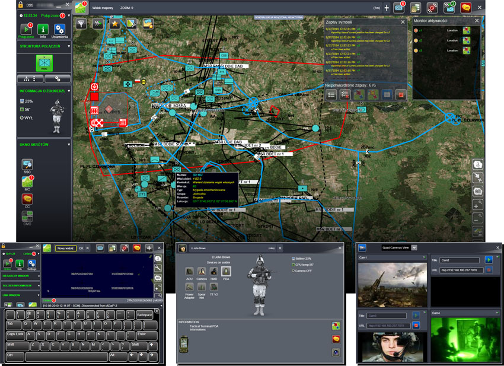
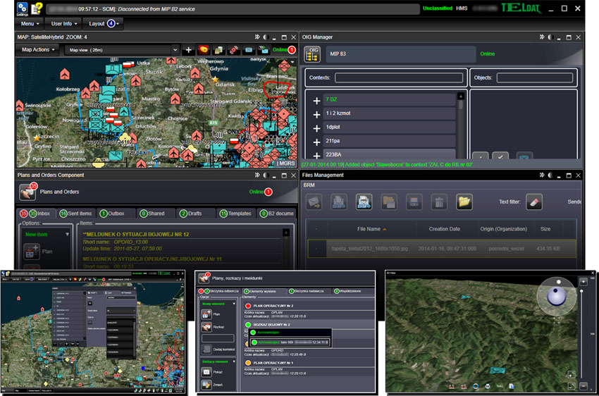
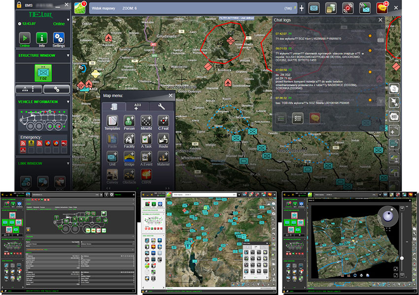

# BMS Jasmine
BMS Jasmine (Jasmin) je obsáhlý síťový _battle management system_ vyvýjený Polskou firmou Teldat. Systém podporuje a automatizuje velení a komunikaci v bojových operacích. Je navrhnut jako kompletní mobilní C2 systém použitelný ve všech druhů vozidel. Jednotlivé prvky systému je také možné použít samostatně.

BMS Jasmine se skládá ze SW (BMS C3IS JASMINE), WAN Access Box integrator, taktických a osobních terminálů a JASMINE Management systému.

## Funkce
- Podpora velení a komunikace ve vojenských operací mezi vysokými a nízkými úrovněmi velení.
- Zvýšení _situational awareness_ pomocí informační nadvlády.
- Aktuální obraz taktické situace (tactical situation picture) a blue force tracking
- Automatická výměna operačních dat.
- Plánování a vizualizace mise.
- Hlášení a management denních logů.
- Textové zprávy (chat).
- Sběr, agregace a archivace dat - umožňuje rekonstrukci událostí.
- Vektorové/rastrové topografické podložky (underlay) na mapě

## DSS C3IS JASMINE - Dismounted Soldier System
SW komponenta C3IS JASMINE pro efektivní management vojáka/skupiny vojáků (combat section) operující na taktické úrovni. Hlavní prvky jsou:
- Automatické výměna informací s vyššími systémy.
- Analýza situace v terénu s 3D visualizací.
- Textové zprávy (chat).
- Plánování mise, příjem plánů a příkazů.
- Průzkum a zaměřování palby.
- Automatické hlášení o aktuální situaci.
- Input grafických objektů na mapu.
- Automatický sběr a agregace dat podřízených.
- Přenos videa.
- Integrace a monitorování výbavy vojáka.

### HMS C3IS JASMINE - Combat Management System for the Operational and Tactical Level
Systém dedikovaný všem úrovní velení a bojovým operacím. Je vytvořený pro využití v mobilním prostředí ve velitelských stanovištích. Hlavní prvky jsou:
- Podpora velení a komunikace na taktické i operační úrovni.
- Distribuce informací o rizicích.
- Blue Force Tracking
- Common Operational Picture
- Plánování a vizualizace mise s plnou podporou pro plány a příkazy
- Hlášení a management denních logů.
- Chat
- Analýza terénu s 3D vizualizací.
- Analýza a vizualizace Fresnelových zón (místa s rádiovým spojením)
- Management příkazů, hlášení a vzorů pro dokumenty
- Sběr, agregace a archivace dat
- Topografické objekty a podložky na mapě

### BMS C3IS JASMINE - Battlefield Management System for Battalion, Company, Platoon & Section
Systém určená pro mobilní velící systémy na taktické úrovni s rádiovou komunikací. Může také fungovat jako samostatný systém. Zhruba ty samé prvky jakou u předchozích systémů.

## Zhodnocení
- Komerční produkt určený pro profesionální armády - není dostupný
- Vyžaduje specifický HW

## Zdroje
- https://www.teldat.com.pl/en/offer/products/systems/167-bms-jasmine.html
- https://www.teldat.com.pl/en/offer/products/software.html
- https://aadcf.nvu.bg/scientific_events/dtf2021/plenary/1%20Biernacik.pdf
- https://www.youtube.com/watch?v=fIonUS9AIc4
- https://defence24.com/polish-engineers-develop-a-new-variant-of-the-bms-suite
